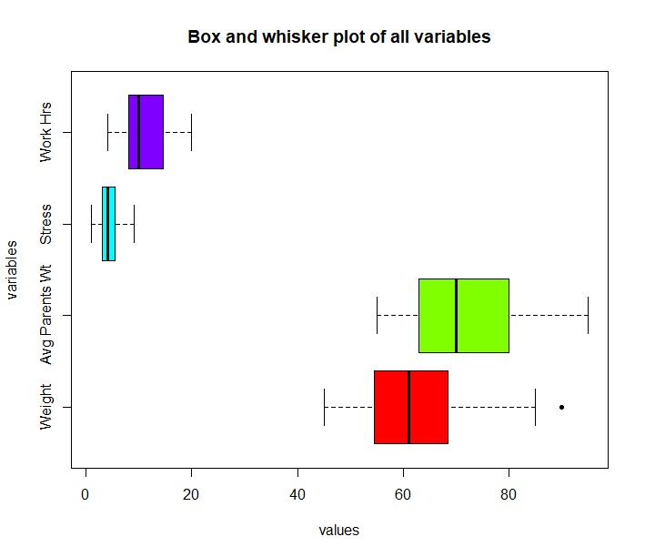
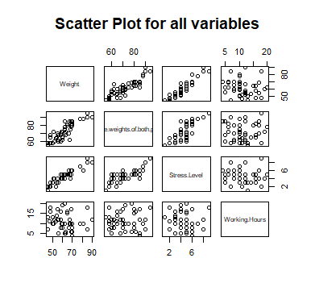

# Weight Prediction Model
<h1>Background</h1>

We were tasked to make a multi linear regression model (MLRM) as an assignment for the course of probability and statistics.

The model will predict weight of a person based on certain factors.

It is a purely statistical model

<h1>Procedure</h1>

We were told that we must read articles and research papers to find the factors that affect the weight of a person

Once the factors were found we were supposed to go and collect data from people for those factors

Then we were supposed to run a MLRM on the data and extract the significant variables

Then we had to adjust the MLRM to only include the significant variables and interpret different types of plots and values

<h1>Implementation</h1>
<ul>
  <li>Data collected using excel sheet</li>
  <li>Model made using R</li>
</ul>
<h1>Plots</h1>
<ul>
  <li>Boxplot</li>
  <li></li>
  <li>Scatter plot</li>
  <li></li>
</ul>
